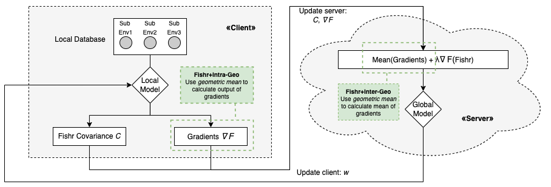
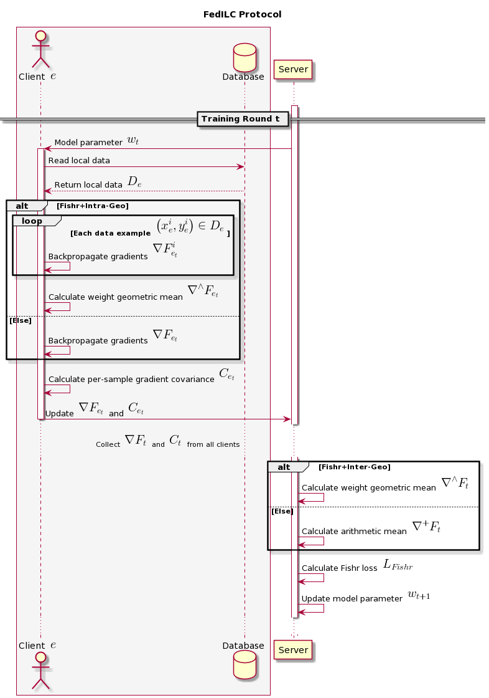

# FedILC: Weighted Geometric Mean and Invariant Gradient Covariance for Federated Learning on Non-IID Data

Federated learning is a distributed machine learning approach which enables a shared server model to learn by aggregating the locally-computed parameter updates with the training data from spatially-distributed client silos. Though successfully possessing advantages in both scale and privacy, federated learning is hurt by domain shift problems, where the learning models are unable to generalize to unseen domains whose data distribution is non-i.i.d. with respect to the training domains. In this study, we propose the Federated Invariant Learning Consistency (FedILC) approach, which leverages the gradient covariance and the geometric mean of Hessians to capture both inter-silo and intra-silo consistencies of environments and unravel the domain shift problems in federated networks. The benchmark and real-world dataset experiments bring evidence that our proposed algorithm outperforms conventional baselines and similar federated learning algorithms. This is relevant to various fields such as medical healthcare, computer vision, and the Internet of Things (IoT). The paper is now available at: <https://arxiv.org/abs/2205.09305>.

The server-client communication protocol of our proposed methods are further demonstrated in the figures below.

### Run the Project

1. First install the required libraries specified in `requirement.txt`

2. Then run the command using `python3 main.py` with the following parameters:

| Parameter               | Description                                                             | Options                                                                                                                                                                                    | Default Option |
|-------------------------|-------------------------------------------------------------------------|--------------------------------------------------------------------------------------------------------------------------------------------------------------------------------------------|----------------|
| `dataset`               | The dataset to run the experiment                                       | `color_mnist`: Color-MNIST dataset  `rotate_cifar`: Rotated-CIFAR10 dataset  `icu`: The eICU dataset                                                                                 | `color_mnist`  |
| `algorithm`             | The algorithm to run the experiment                                     | `arith`: FedSGD  `geo_weighted`: Weighted geometric mean  `fishr`: FedCurv  `fishr_arith`: Fishr+Intra-Arith  `fishr_geo`: Fishr+Intra-Geo  `fishr_hybrid`: Fishr+Inter-Geo | `arith`        |
| `learning_rate`         | The learning rate                                                       | -                                                                                                                                                                                          | 0.0001         |
| `weight_decay`          | The weight decay                                                        | -                                                                                                                                                                                          | 0.001          |
| `train_batch_size`      | The training batch size                                                 | -                                                                                                                                                                                          | 32             |
| `test_batch_size`       | The test batch size                                                     | -                                                                                                                                                                                          | 32             |
| `num_restarts`          | The seeds to run the experiment                                         | -                                                                                                                                                                                          | 5              |
| `num_rounds`            | The federated training rounds                                           | -                                                                                                                                                                                          | 501            |
| `num_epochs`            | The training epochs per federated training round                        | -                                                                                                                                                                                          | 1              |
| `penalty_anneal_iters`  | The federated training rounds to adjust Fishr hyperparameter λ          | -                                                                                                                                                                                          | 0              |
| `penalty_weight_factor` | The adjusted Fishr hyperparameter λ after `penalty_anneal_iters` rounds | -                                                                                                                                                                                          | 1.0            |
| `penalty_weight`        | The default Fishr hyperparameter λ after `penalty_anneal_iters`  rounds | -                                                                                                                                                                                          | 1.0            |
| `agreement_threshold`   | The agreement threshold to apply the masks of Geometric mean            | -                                                                                                                                                                                          | 0.0            |